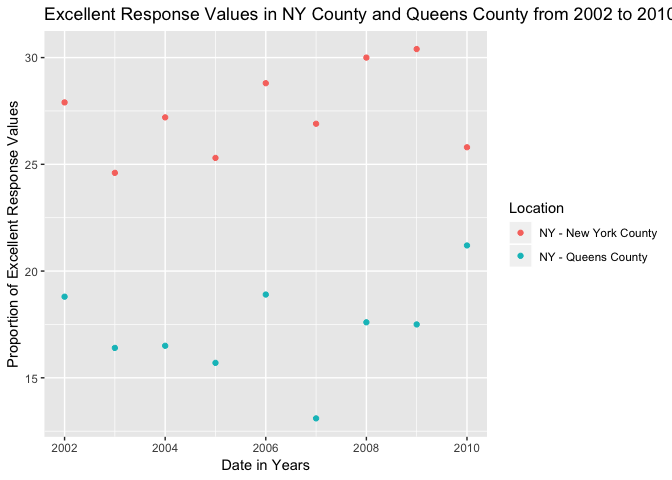

p8105\_hw2\_kb2977
================
Francois Ban
9/28/2018

Problem 1
---------

### Part 1: NYC Transit Data

Below using pipline, I did the following:

1.  Import NYC Transit data using relative paths into a subdirectory
2.  Read and clean the data
3.  Retain line, station, name, station latitude / longitude, routes served, entry, vending, entrance type, and ADA compliance.
4.  Convert the entry variable from character (YES vs NO) to a logical variable.

``` r
transit_data = 
  read_csv(file = "./data/nyc_transit_data.csv") %>% 
  janitor::clean_names() %>% 
  select(line, starts_with("station"), starts_with("route"), entrance_type, entry, vending, ada, 
         -station_location) %>%
  mutate(entry = recode(entry, "YES" = TRUE, "NO" = FALSE))
```

    ## Parsed with column specification:
    ## cols(
    ##   .default = col_character(),
    ##   `Station Latitude` = col_double(),
    ##   `Station Longitude` = col_double(),
    ##   Route8 = col_integer(),
    ##   Route9 = col_integer(),
    ##   Route10 = col_integer(),
    ##   Route11 = col_integer(),
    ##   ADA = col_logical(),
    ##   `Free Crossover` = col_logical(),
    ##   `Entrance Latitude` = col_double(),
    ##   `Entrance Longitude` = col_double()
    ## )

    ## See spec(...) for full column specifications.

Explanation of dataset:

The variables line, station name, station latitude/longitude, route number, entrance type, entry, vending, and ada were include in the dataset "transit\_data". First, I read in the csv file of the NYC transit data then cleaned the names by using janitor::clean\_names and changed the variable names to lowerclass and put in "\_" for spaces. I also recoded the variable "entry" to a logical variable (i.e. TRUE and FALSE). The resulting data has 1868 rows and 19 columns. This data isn't tidy because we see that route number is spread across 11 columns.

### Part 2: Distinct NYC Transit Stations

Answering following questions using transit\_data from above:

-   There are 465 distinct stations.
-   There are 84 stations that are ADA compliant.
-   0.0369 of station entrances and exits without vending are allowed entrance.

Below is the reformated data so that route number and route name are distinct variables.

``` r
transit_data_tidy = transit_data %>% 
  gather(key = route_number, value = route_name, route1:route11)
```

-   There are 60 distinct stations that serve the A train.
-   Of the 60 distinct stations that serve the A train, 17 are ADA compliant.

Problem 2
---------

### Part 1: Mr. Trash Wheel Data

Below I made these changes to the Mr. Trash Wheel Data:

1.  Read and clean the Mr. Trash Wheel sheet
2.  Specify the sheet in the Excel file and to omit columns containing notes (using the range argument and cell\_cols() function)
3.  Use reasonable variable names
4.  Omit rows that do not include dumpster-specific data
5.  Round the number of sports balls to the nearest integer and convert the result to an integer variable (using as.integer)

``` r
library(readxl)
trash_wheel_data = 
  read_excel("data/HealthyHarborWaterWheelTotals2017-9-26.xlsx", sheet = "Mr. Trash Wheel", 
             range = "A2:N258") %>% 
  janitor::clean_names() %>%
  filter(!is.na(dumpster)) %>%
  mutate(sports_balls = round(sports_balls), 
         sports_balls = as.integer(sports_balls))
```

### Part 2: Percipitation Data 2016 and 2017

Directions: Read and clean precipitation data for 2016 and 2017. For each, omit rows without precipitation data and add a variable year. Combine datasets and convert month to a character variable (the variable month.name is built into R and should be useful).

-   Data manipulation for Mr. Trash Wheel precipitation data 2016:

``` r
prec_2016 = 
  read_excel("data/HealthyHarborWaterWheelTotals2017-9-26.xlsx", sheet = "2016 Precipitation", skip = 1) %>%
  janitor::clean_names() %>%
  filter(!is.na(total)) %>%
  filter(!is.na(month)) %>%
  add_column(year = 2016)
```

-   Data manipulation for Mr. Trash Wheel precipitation data 2017:

``` r
prec_2017 = 
  read_excel("data/HealthyHarborWaterWheelTotals2017-9-26.xlsx", sheet = "2017 Precipitation", skip = 1) %>%
  janitor::clean_names() %>%
  filter(!is.na(total)) %>%
  filter(!is.na(month)) %>%
  add_column(year = 2017)
```

-   Combining precipitation data 2016 and 2017:

``` r
combined_prec_data = rbind(prec_2016, prec_2017) %>%
  mutate(month = month.name[month])
```

### Part 3: Explaining both Mr. Trash Wheel Data (from Part 1) and Combined Precipitation Data (from Part 2)

Directions: Write a paragraph about these data; you are encouraged to use inline R. Be sure to note the number of observations in both resulting datasets, and give examples of key variables. For available data, what was the total precipitation in 2017? What was the median number of sports balls in a dumpster in 2016?

In the Trash Wheel Dataset from Part 1, there were 215 observations. The following variables were included in this dataset: chip\_bags, cigarette\_butts, date, dumpster, glass\_bottles, grocery\_bags, homes\_powered, month, plastic\_bottles, polystyrene, sports\_balls, volume\_cubic\_yards, weight\_tons, year. The data included was collected from year 2014 to year 2017 The median number of sports balls in a dumpster in 2016 was 26.

In the Combined Precipitation Data from Part 2, there were 20 observations. The following variables were included in this dataset: month, total, year. The total precipitation in 2017 was 29.93.

Problem 3
---------

### Part 1: Cleaning brfss\_smart2010 Data

Below I cleaned the dataset by doing the following:

1.  Format the data to use appropriate variable names
2.  Focus on the “Overall Health” topic
3.  Excluding variables for class, topic, question, sample size, and everything from lower confidence limit to GeoLocation
4.  Structure data so that values for Response (“Excellent” to “Poor”) are column names / variables which indicate the proportion of subjects with each response (which are values of Data\_value in the original dataset)
5.  Creating a new variable showing the proportion of responses that were “Excellent” or “Very Good”

``` r
devtools::install_github("p8105/p8105.datasets")
```

    ## Skipping install of 'p8105.datasets' from a github remote, the SHA1 (21f5ad1c) has not changed since last install.
    ##   Use `force = TRUE` to force installation

``` r
library(p8105.datasets)
data(brfss_smart2010)
```

``` r
brfss_data =
  brfss_smart2010 %>%
  janitor::clean_names() %>% 
  filter(topic == "Overall Health") %>% 
  select(-class, -topic, -question, -sample_size, -confidence_limit_low:-geo_location) %>% 
  spread(key = response, value = data_value) %>%
  mutate(prop_exc_vg = Excellent + `Very good`)
```

### Part 2: Answering Questions using Cleaned brfss Dataset from Above

Using this dataset, do or answer the following:

1.  How many unique locations are included in the dataset?
    -   2125 unique locations
2.  Is every state represented?
    -   Yes, 51 states are represented including DC.
3.  What state is observed the most?
    -   WY is observed the most
4.  In 2002, what is the median of the “Excellent” response value?
    -   22 is the median of "Excellent" responses
5.  Make a histogram of “Excellent” response values in the year 2002.

``` r
library(ggridges)
```

    ## 
    ## Attaching package: 'ggridges'

    ## The following object is masked from 'package:ggplot2':
    ## 
    ##     scale_discrete_manual

``` r
prop_exc_2002_hist = brfss_data %>% 
  filter(year == "2002") %>% 
  ggplot(aes(x = Excellent)) + 
  geom_histogram() +
  labs(
    title = "Excellent Response Values in 2002",
    x = "Excellent Response Values",
    y = "Frequency"
  )
prop_exc_2002_hist
```

    ## `stat_bin()` using `bins = 30`. Pick better value with `binwidth`.

    ## Warning: Removed 2 rows containing non-finite values (stat_bin).


1.  Make a scatterplot showing the proportion of “Excellent” response values in New York County and Queens County (both in NY State) in each year from 2002 to 2010.

``` r
prop_exc_NY_QC_sp = brfss_data %>%
  filter(locationdesc == "NY - Queens County" | locationdesc == "NY - New York County") %>%
  ggplot(aes(x = year, y = Excellent, color = locationdesc)) + 
  geom_point() +
  labs(
    title = "Excellent Response Values in NY County and Queens County from 2002 to 2010",
    x = "Date in Years",
    y = "Proportion of Excellent Response Values"
  ) +
  scale_color_discrete(name = "Location")
prop_exc_NY_QC_sp
```


